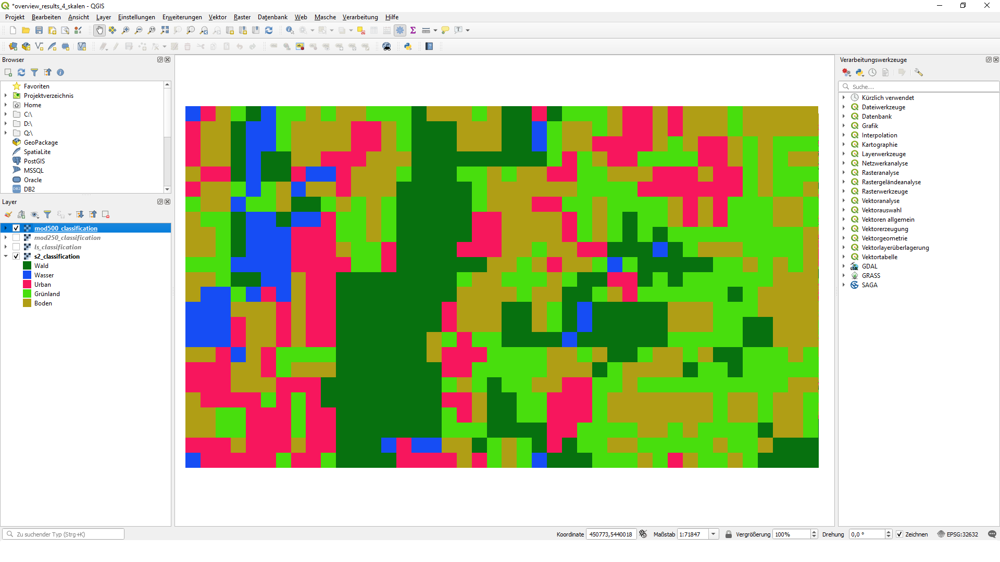
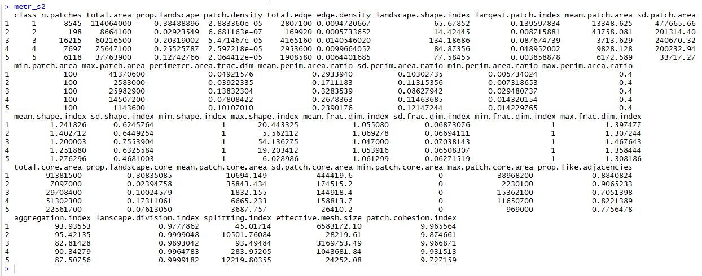
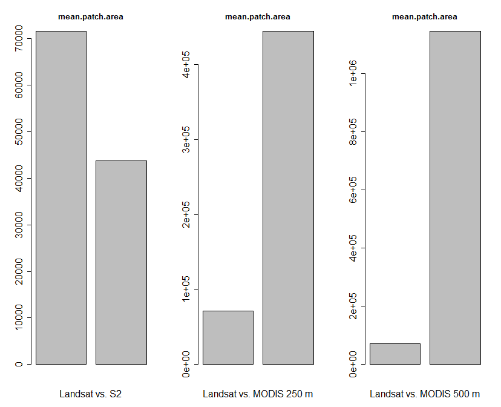
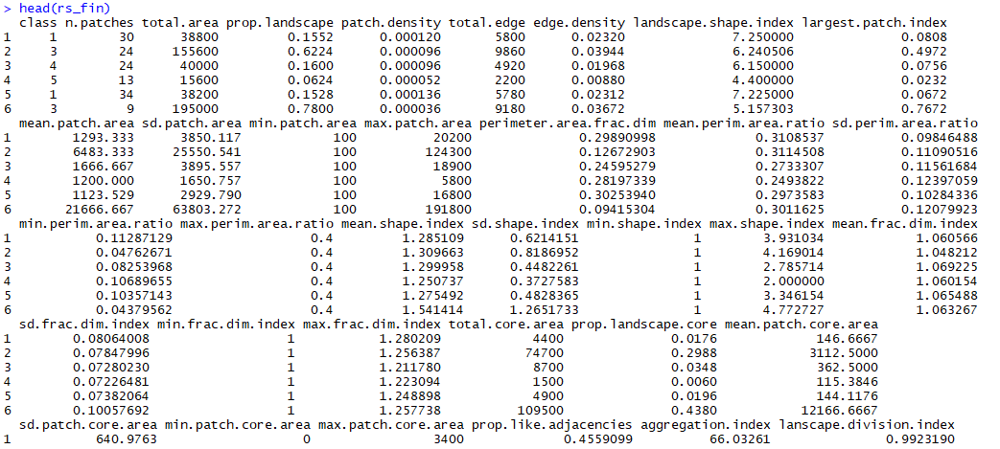
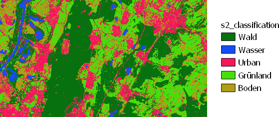

## Calculation of Landscape Metrics from a Land-cover raster map in R ##

# Overview #

In this lecture you will learn how to calculate landscape metrics from a land-cover map saved as a raster file in R. The idea is that you can later use the supervised classification results from the practical of the first day as input to this tutorial. However, for the tutorial itself, a dataset of four land-cover classification maps is provided. More details below.

The learned processing steps include:

- load the land cover map to R
- calculate the landscape metrics for the entire raster image
- calculate the landscape metrics for subsets of the image to create a landscape metric map

Besides R, we will also use QGIS in this tutorial.  In case you do not have QGIS installed, please download it at [https://qgis.org/en/site/forusers/download.html](https://qgis.org/en/site/forusers/download.html "QGIS") and install it - this should be straightforward and all the necessary instructions are given on the webpage.

# Datasets used in this Tutorial #

In this tutorial we will use four land-cover maps that were created by a supervised classification. The four maps all show the same area around Karlsruhe with the same five land-use classes and at approximately the same point in time. However, the data from which the maps were derived differ and originate from three different satellite sensors:

1. Sentinel 2: 10 m pixel size
2. Landsat 8: 30 pixel size
3. MODIS: 250 m pixel size
4. MODIS: 500 m pixel size

The data are available here:

[https://drive.google.com/drive/folders/1LULH7ur_wnZIcxlayWlE0EMbPElrAe0t?usp=sharing](https://drive.google.com/drive/folders/1LULH7ur_wnZIcxlayWlE0EMbPElrAe0t?usp=sharing "Dataset landscape metrics")

# Step 1: Getting familiar with the dataset #

We will now first have a look at the data that we are working with. So please download the dataset given at the link above unzip the files and then open the QGIS project by double-clicking the file

**overview\_results\_4\_skalen.qgz**

Now QGIS should open and show the following:

The QGIS project shows the four land-cover classification maps we will be using in the Tutorial. You can browse through the other three maps by activating the layers in the "Layer" window on the lower left in QGIS. Currently, the data with the highest spatial resolution ("grain") is depicted. If you activate the **mod500_classification** layer, the view in QGIS will look seen below and you can easily see the difference in spatial resolution ("grain") between the two land-cover maps. Despite the grain differences, you can still see that the two maps show roughly the same patterns in terms of land-cover patterns with the big forest area at the center left, larger water areas in the western part of the map and a mosaic of all land-cover classes in the eastern part of the map- 

Please have a look also at the two other provided maps which have spatial resolutions between the two depicted datasets. Next, we will load the data into R and start calculating the landscape metrics for the complete image.

# Step 2: Load the land cover maps to R and plot them 

First, we will load all required packages. R will give you a warning message in case a package is not installed yet. If this is the case, please install the packages either through the main
menu of Rstudio by selecting "Tools" => "Install packages" and then following the appearing dialogue, or by entering the corresponding R code
to install the packages into the console. E.g., to install the package "raster" use the code:

	install.packages("raster")

After loading the packages by running:

	# load requires packages
    require(raster)
	require(SDMTools)
	require(doParallel)
	require(foreach)

After all packages are successfully installed, we will load the land cover raster maps using two steps. First, change the path to the folder containing the image, then execute the "raster" command to load the image. To check whether you are in the correct folder, you can display all files of the folder using the list.files()-command.
In this case it is important to use the "raster" command instead of the "stack" command due to the input format required by the function we will use to calculate the landscape metrics. 

	## load land-cover maps derived from S2

	# set working directory to the folder where you stored the data for the tutorial
	setwd("E:/Tag2_landscape_metrics/")
	list.files()

	# load the land cover classification raster maps
	s2_luc <- raster("s2_classification.tif")	
	ls_luc <- raster("ls_classification.tif")
	mod250_luc <- raster("mod250_classification.tif")
	mod500_luc <- raster("mod500_classification.tif")

To check whether the data has been loaded correctly, we can briefly plot the four maps using the following commands:

	# open a new display window
	x11()
	
	# change plot settings to plot all four plots in one window using 2 columns and 2 rows
	par(mfrow=c(2,2))

	# plot the images
	plot(s2_luc)
	ploz(ls_luc)
	plot(mod250_luc)
	plot(mod500_luc)
	

This will result in the following plot:

If we prefer to invest a bit more time into the plot to allow for an easier interpretation of the landcover classes, we can make it look a bit more like in the QGIS visualization that we saw before by running the following code:

	
	## alternative, nicer-looking plot
		
	# open a new display window
	x11()
	
	# change plot settings to plot all four plots in one window using 3 rows and 2 columns
	par(mfrow=c(2,3))

	# prepare coloring
	cuts=c(0,1,2,3,4,5) #set breaks
	pal <- colorRampPalette(c("darkgreen", "blue", "brown1", "chartreuse2", "darkgoldenrod1"))
	
	# plot the images
	plot(s2_luc, breaks=cuts, col = pal(5), legend=F)
	plot(ls_luc, breaks=cuts, col = pal(5), legend=F)
	plot(mod250_luc, breaks=cuts, col = pal(5), legend=F)
	plot(mod500_luc, breaks=cuts, col = pal(5), legend=F)
	# plot dummy to include legend
	plot(mod500_luc, col = "white", axes=F, ann=F, xaxt="n", yaxt="n", box=F, legend=F)
	#plot legend
	legend("bottomleft", legend=c("Forest","Water","Urban","Grassland", "Bare soil"),fill=c("darkgreen", "blue", "brown1", "chartreuse2", "darkgoldenrod1"))
	

This will look like this:

	
# Step 3: Calculate landscape metrics for the entire image #

After successfully loading and plotting the images, we will now calculate the landscape metrics for each image. We will accomplish this using the SDMTools packages and the "ClassStat" and the "PatchStat" functions. The two functions only require the input raster (expected is a categorical raster file) and a user-defined cellsize, which in our case will be the spatial resolution of the corresponding satellite sensors. We can calculate the landscape metrics by running the following lines:

	# calculate class-stats for each image
	metr_s2 <- ClassStat(s2_luc, cellsize=10)
	metr_ls <- ClassStat(ls_luc, cellsize=30)
	metr_mod250 <- ClassStat(mod250_luc, cellsize=250)
	metr_mod500 <- ClassStat(mod500_luc, cellsize=500)
	
	# calculate patch-stats for each image
	patch_s2 <- PatchStat(s2_luc, cellsize=10)
	patch_ls <- PatchStat(ls_luc, cellsize=30)
	patch_mod250 <- PatchStat(mod250_luc, cellsize=250)
	patch_mod500 <- PatchStat(mod500_luc, cellsize=500)

This calculation may take a few seconds. Once they are ready, we will be able to have a look at the calculated metrics and also make some comparisons between the four land-cover maps.

First of all we are interested in what kind of metrics were calculated. To see the names and the definitions of the calculated metrics, we can have a look at the details of the applied functions by running the code:

	?ClassStat
	?PatchStat

For simply seeing the names of the metrics, we can also run:

	colnames(metr_s2)
	colnames(patch_s2)

Now, let us have a closer look on what has actually been calculated. If we simply run the objects that were created by calling the functions, we can see that all landscape metrics have been calculated for all of the five land-cover classes in the image. Running:

	metr_s2

will result in:

Here, it becomes clear that for each class and landscape metric, a single value is given. Some of the metrics are quite easy to interprete such as "**prop.landscape**" which simply  indicates the fractional cover of the land-cover class in the complete image. Hence, in this case, the values of all five classes should add-up to 1.
For understanding also the other metrics, it is recommended to have a closer look at the details provided in the descriptions of the r-package and the citations given there.

We will now try to make some comparisons of values between the four input land-cover datasets with varying spatial resolution. To do this, we will create some bar plots. To get the plots, we first have to select which landscape metric we want to have a look at and then the land-cover class for which we want to compare the values:

	metric=10
	luc_class=2

Remember, for getting the names of the calculated landscape metrics we can run:

	colnames(metr_s2)

If we want to know how the 10th calculated metric is called, we can also run:

	colnames(metr_sw)[10]

Now, lets plot some comparative barplots to always compare the values of landscape metric 10 (mean patch area) calculcated for land cover class 2 (water) of Landsat with the three other input datasets:

	# selected metric and class
	metric=10
	luc_class = 2
	
	# make plots
	x11()
	par(mfrow=c(1,3))
	barplot(c(metr_ls[luc_class,metric], metr_s2[luc_class,metric]), xlab="Landsat vs. S2", main=paste0(colnames(metr_ls)[metric]), cex.axis=1.5, cex.lab = 1.5)
	barplot(c(metr_ls[luc_class,metric], metr_mod250[luc_class,metric]), xlab="Landsat vs. MODIS 250 m", main=paste0(colnames(metr_ls)[metric]), cex.axis=1.5, cex.lab = 1.5)
	barplot(c(metr_ls[luc_class,metric], metr_mod500[luc_class,metric]), xlab="Landsat vs. MODIS 500 m", main=paste0(colnames(metr_ls)[metric]), cex.axis=1.5, cex.lab = 1.5)

This will result in:

We can see that even though we calculated the same metric, for the same class and the same landscape with the same extent, the differences in spatial resolution of the input datasets, leads to quite strong differences in mean patch area. The differences are stronger, the stronger the resolution differences are. However, this of course also depends on the applied metric and land-cover class. You can now try to make some more comparisons, by changing the variables **metric** and **luc_class** in the code and then re-run the plot command.

# Step 4: Calculate landscape metrics for a grid  #

So far, we calculated a single landscape metric for the whole land-cover map. In our case, the landscape is still comparably small in size so calculating a single metric for the whole landscape, may make sense for some applications. However, in many other cases, we might either have a larger landscape at hand or we might be interested to also see how our landscape varies in terms of its metrics at a finer spatial grain as compared to the complete landscape. In the following, we will adjust the code used above to calculate landscape metrics for smaller sub-parts of the land-cover maps.

This will require that we put the calculation into a loop and before running this loop we will have to create a  grid with a user-defined grid cell size. In the following, the code will be presented step by step. First we define the grid-cell size:

	# define a tile size for which you want to compute the landscape metrics
	tile_size <- 500
	
In our case this would mean 500 m - but this will depend on the applied coordinate reference system. As we are using data in the metric UTM coordinate reference system, the 500 is fine. It would be more complicated when using the geographic coordinate system with Latitude and Longitude as in this case the grid cell size would have to be defined in geographic degrees. Next, we define the input dataset for which we want to create the grid and extract its extent. In this case, we will use the land-cover map derived from Sentinel-2

	# define the land-use map you want to use as input
	inp <- s2_luc
	
	# use extent of raster layer to prepare grid cells
	# with the tile size defined above 
	e <- extent(inp)
	
	# check what e looks like by running
	e

This will result in the following:

We can see that the variable e contains the outer margins of our input image with minimum and maximum x and y coordinates, respectively. From this, we will now derive the total width and height of the area the image is covering by running (the results will be in meter as we are in the metric coordinate system):

	# get x and y ranges
	x_ra <- (e[2]-e[1]) 
	y_ra <- (e[4]-e[3]) 

Then we will set the grid-cell size by assigning the user-defined value from above to two variables, representing the x and y direction. The two variables will be required in the code below. Be aware that we in theory could also use non-quadratic grid cells, but for now, let's just stay with the quadratic cells.
	
	# set x,y lengths of grid to user defined tile size
	x_r <- tile_size
	y_r <- tile_size
	

Now we are ready to run a nested for-loop to create the grid cell coordinates:
	
	# create list to store the results of the tile coordinates
	cases <- list()
	
	# create coordinates of all tiles
	iter=1
	for (i2 in 1:(floor(x_ra/x_r))) {
	  for (i in 1:(floor(y_ra/y_r))) {
	    
	    e <- extent(inp)
	    e[1] <- e[1] + (i2-1)*x_r
	    e[2] <- e[1] + x_r
	    e[3] <- e[3] + (i-1)*y_r
	    e[4] <- e[3] + y_r
	    cases[[iter]] <- c(e[1], e[2], e[3], e[4])
	    iter = iter+1
	  }
	}
	
	# unbind tile coordinate list
	cases2 <- do.call(rbind, cases)
	# asign meaningful colnames
	colnames(cases2) <- c("xmin", "xmax", "ymin", "ymax")
	# check final coordinate list
	head(cases2)

I will not get into details here about what this code is doing exactly, but feel free to explore the code a bit more. In short, this code will return a list of coordinate-sets defining the 500 m grid-cells for which we will calculate our landscape metrics. The last r command in the code **head(cases2)** will result in:

So you can see that each row in the "**cases2**"-variable has the same structure as the "**e**" variable from above and basically describes the outer margin of a single grid-cell.

OK! Now let's calculate the metrics for the grid. In the following, we will run the code in a parallelized script. This will enable a notably faster processing time, if the computer has more than one cpu/core available. To do this, we only have to change some parts of the code in comparison to a normal for-loop. Again, I will not go into details here, but in case you are interested in how this works exactly, you can get some first information here:

[https://cran.r-project.org/web/packages/doParallel/vignettes/gettingstartedParallel.pdf](https://cran.r-project.org/web/packages/doParallel/vignettes/gettingstartedParallel.pdf "Parallel processing")

Now, let us have a look at the code. First, we start the process by initalizing the parallel processing:
	
	#setup parallel backend to use more than one processors

	# define number of cores (you can switch the value to a higher numer of your computer has more cores)
	# for checking how many cores your computer has you can run: detectCores()
	ncors=2
	cl<-makeCluster(ncors)
	registerDoParallel(cl)
	
	# get timestamp to see how long the process takes
	print(timestamp())
	

At this point the pure processing part begins. The processing is devided into four steps. First, the extent of the i-th grid cell is defined by taking the i-th row from the variable **cases2** created above. Second, the raster image is clipped with the extent. Third, landscape metrics are caclulated for the clipped raster-subset. Fourth, all metrics are merged into a single variable **cstat2** and center coordinates of the current grid cell are added to this variable (to allow for copying the information back to a raster later on). This variable is then returned and the next iteration is started:

	rs <- foreach(i=1:length(cases2[,1]), .packages=c("raster", "SDMTools")) %dopar% {
	    
	  # create an extent file using the coordinates from the coordinate list
	  e2 <- extent(cases2[i,1], cases2[i,2], cases2[i,3], cases2[i,4])
	  # crop the large image to the tile
	  img <- crop(inp, e2)
	  
	  # calculate landscape metrics for the file
	  cstat <- ClassStat(img, cellsize = 10)
	  cstat1 <- PatchStat(img, cellsize = 10)
	
	  cstat2 <- cbind(cstat, cstat1)
	  
	  # transform results to dataframe
	  cstat2 <- as.data.frame(cstat2)
	  
	  # attach mean x and y coordinates to the results for comfortable plotting afterwards
	  x_mean <- (cases2[i,1] + cases2[i,2])/2
	  y_mean <- (cases2[i,3] + cases2[i,4])/2
	  
	  cstat2$xm <- rep(x_mean, length(cstat2[,1]))
	  cstat2$ym <- rep(y_mean, length(cstat2[,1]))
	
	  #patch
	  
	  #return final dataframe to store in list
	  cstat2
	  
	}
	
	# stop parallel processing
	stopCluster(cl)
	
	#get another timestamp to see how long it tood
	print(timestamp())

After landscape metrics have been calculated for all grid cells, the raw output data has to be further processed to transfer them back into raster files. The result of the for-loop described above are stored in a variable called "**rs**" which is in the list-format of R. As first step, we transfer this list into a dataframe by applying the rbind-function to all entries in the list:

	
	# check first results
	head(rs)
	# bind all results to have one large dataframe
	rs_fin <- do.call(rbind, rs)
	
	#check final results
	head(rs_fin)

This results in:

Next, we extract one of the landscape metrics for one of the five examined land-cover classes and save it as a raster file. In theory all calculated metrics could be saved using the same procedure with some small adaptations to the code. In the code below we select the landcover class 1 which is forest. Details are provided in the comments to the code.
	
	##################################################
	## start postprocessing results
	##################################################
	
	## extract number of patches for yth land-use class
	
	dev.off()
	
	# select land-cover class (1 = forest)
	luc_class=1
	
	# subset the overall results to only keep values of the selected land-cover class
	rs_fin_cl <- rs_fin[rs_fin$class==luc_class,]
	
	# check the available metrics
	colnames(rs_fin_cl)
	
	# select one metric - in this case metric 4 which is the percentage cover of the target class
	# in a given grid cell 
	metric = 4
	
	# prepare map of percentage cover of forest
	# to do this, first build a table including the center coordinates of each grid cell
	# and the selected metric
	inp_ras <- cbind(rs_fin_cl$xm, rs_fin_cl$ym, rs_fin_cl[,metric])
	
	# then use the rasterfromXZY-function to create a raster file
	dfr <- rasterFromXYZ(inp_ras)

	# copy the coordinate reference system information to transfer the raster to a
	# raster with geoinformation
	crs(dfr) <- crs(ls_luc)
	
	# plot the map
	plot(dfr, main=colnames(rs_fin_cl)[metric])
	
	# save result to tiff-file that can be opened in QGIS
	writeRaster(dfr, "prop_forest_area.tif", format="GTiff", overwrite=T)

We have now calculated a first landscape metric-map in R. We can check our results by loading the just created prop\_forest_area.tif file into our QGIS project from the start of the tutorial. If we now compare the land-cover map with the percentage cover raster we calculated (depicted below after adapting the visualization settings), we can see that the results seem plausible. Grid cells covered only by forest have a 100% cover (value of 1) while areas with only smaller fractions of forest, show the corresponding values:

You can see in the QGIS project that the current processing flow is not yet perfect, as we are losing a small part of the image edges (the created raster does not have exactly the same size as the input image). This is not fully solvable as long as the x- and y-ranges of the input image are not evenly dividable by the selected grid cell size. Related problems have been discussed in the theoretical part of today's course session. 

So you have now learned all the processing steps required to calculate landscape metrics from a land-cover map in R. For training and better understanding the code, I would recommend to adjust the code above a bit to calculate some more landscape metrics and also compare metrics amongst the different input-datasets with varying spatial resolution. In next week's practical exercise you will have to use the work-flow learned here, to solve a small ecological question.